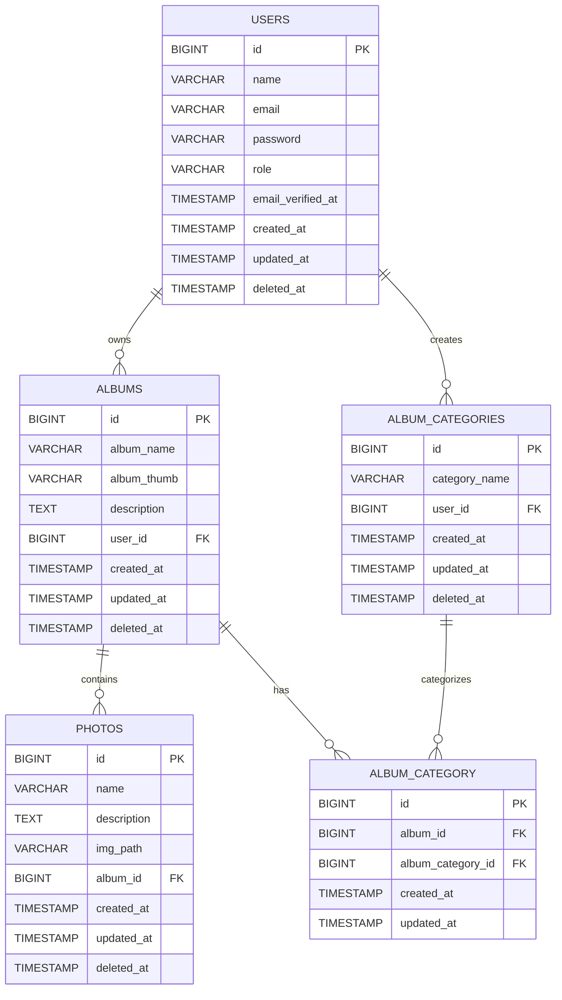

# 📸 Photo Gallery Database Design

## 📌 Overview

Questo database gestisce:

- Utenti
- Album fotografici
- Categorie
- Foto
- Relazioni Many-to-Many tra Album e Categorie

---

## 🧱 Tables

### 👤 users

| Field              | Type           | Description              |
|------------------|----------------|--------------------------|
| id               | BIGINT         | Primary Key              |
| name             | VARCHAR(191)   | Nome utente              |
| email            | VARCHAR(64)    | Email unica              |
| password         | VARCHAR(191)   | Password hash            |
| role             | VARCHAR(16)    | Ruolo (admin/user)       |
| remember_token   | VARCHAR(100)   | Token sessione           |
| email_verified_at| TIMESTAMP      | Verifica email           |
| created_at       | TIMESTAMP      | Created                  |
| updated_at       | TIMESTAMP      | Updated                  |
| deleted_at       | TIMESTAMP      | Soft delete              |

---

### 📁 albums

| Field        | Type         | Description              |
|-------------|--------------|--------------------------|
| id          | BIGINT       | Primary Key              |
| album_name  | VARCHAR(128) | Nome album               |
| album_thumb | VARCHAR(128) | Thumbnail                |
| description | TEXT         | Descrizione              |
| user_id     | BIGINT       | FK → users               |
| created_at  | TIMESTAMP    | Created                  |
| updated_at  | TIMESTAMP    | Updated                  |
| deleted_at  | TIMESTAMP    | Soft delete              |

---

### 🏷️ album_categories

| Field         | Type         | Description              |
|--------------|--------------|--------------------------|
| id           | BIGINT       | Primary Key              |
| category_name| VARCHAR(64)  | Nome categoria           |
| user_id      | BIGINT       | FK → users               |
| created_at   | TIMESTAMP    | Created                  |
| updated_at   | TIMESTAMP    | Updated                  |
| deleted_at   | TIMESTAMP    | Soft delete              |

---

### 🔗 album_category (Pivot)

| Field               | Type      | Description                        |
|--------------------|----------|------------------------------------|
| id                 | BIGINT   | Primary Key                        |
| album_id           | BIGINT   | FK → albums                        |
| album_category_id  | BIGINT   | FK → album_categories              |
| created_at         | TIMESTAMP| Created                            |
| updated_at         | TIMESTAMP| Updated                            |

---

### 🖼️ photos

| Field       | Type         | Description              |
|------------|--------------|--------------------------|
| id         | BIGINT       | Primary Key              |
| name       | VARCHAR(128) | Nome foto                |
| description| TEXT         | Descrizione              |
| img_path   | VARCHAR(128) | Path immagine            |
| album_id   | BIGINT       | FK → albums              |
| created_at | TIMESTAMP    | Created                  |
| updated_at | TIMESTAMP    | Updated                  |
| deleted_at | TIMESTAMP    | Soft delete              |

---

## 🔗 Eloquent Relationships

### Relationship Diagram

```
┌─────────────┐         hasMany          ┌───────────────┐
│    User     │─────────────────────────▶│     Album     │
│             │─────────────────────────▶│               │
│             │      hasMany             │  - user()     │
│             │                          │  - photos()   │
└─────────────┘                          │  - categories()│
       │                                 └───────────────┘
       │                                          ▲
       │ hasMany                                  │ belongsTo
       ▼                                          │
┌─────────────┐                                   │
│AlbumCategory│◀──────────────────────────────────┘
│             │      belongsToMany (via pivot)
│  - user()   │         albums()
│  - albums() │
└─────────────┘
       ▲
       │ belongsTo
┌─────────────┐
│ CategoryAlbum│  (pivot table: album_category)
│             │
│  - category()│
│  - album()   │
└─────────────┘
       │
       │ hasMany
       ▼
┌─────────────┐
│    Photo    │
│             │
│  - album()  │
└─────────────┘
```

### Relationship Details

| Model | Relation | Type | Foreign Key | Description |
|-------|----------|------|-------------|-------------|
| **User** | `albums()` | hasMany | `user_id` on albums | A user has many albums |
| **User** | `albumCategories()` | hasMany | `user_id` on album_categories | A user has many categories |
| **Album** | `user()` | belongsTo | `user_id` | An album belongs to one user |
| **Album** | `photos()` | hasMany | `album_id` on photos | An album has many photos |
| **Album** | `categories()` | belongsToMany | via `album_category` pivot | Many-to-many with AlbumCategory |
| **AlbumCategory** | `user()` | belongsTo | `user_id` | A category belongs to one user |
| **AlbumCategory** | `albums()` | belongsToMany | via `album_category` pivot | Many-to-many with Album |
| **Photo** | `album()` | belongsTo | `album_id` | A photo belongs to one album |
| **CategoryAlbum** | `category()` | belongsTo | `album_category_id` | Pivot belongs to category |
| **CategoryAlbum** | `album()` | belongsTo | `album_id` | Pivot belongs to album |

### Quick Reference

```php
// User relationships
$user->albums;           // Collection of Album models
$user->albumCategories;  // Collection of AlbumCategory models

// Album relationships
$album->user;            // User model
$album->photos;          // Collection of Photo models
$album->categories;      // Collection of AlbumCategory models (via pivot)

// AlbumCategory relationships
$category->user;         // User model
$category->albums;       // Collection of Album models (via pivot)

// Photo relationships
$photo->album;           // Album model

// Pivot relationships
$pivot->category;        // AlbumCategory model
$pivot->album;           // Album model
```

---

## 📊 ER Diagram (Mermaid)


